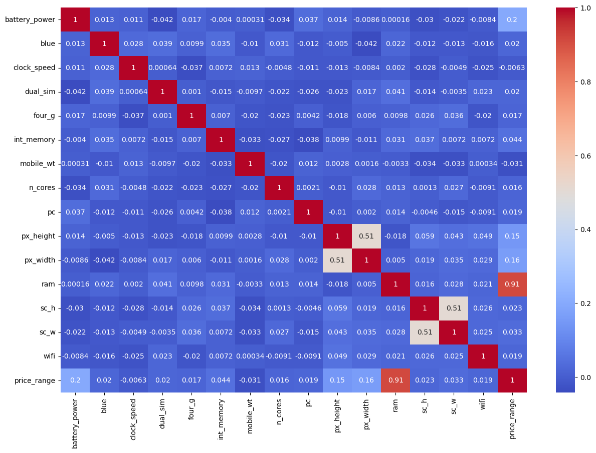

# Mobile Price Prediction & Analysis 📱

## 📌 Project Overview
This project focuses on **cleaning, analyzing, and preparing** a mobile phone dataset for machine learning tasks. The goal is to transform raw data containing specifications (like RAM, Battery, Cores) into a clean, structured format ready for price classification models.

## 📂 Repository Structure
The project is organized as follows:

- `data/`: Contains the raw Excel file and the processed CSV file.
- `notebooks/`: Jupyter Notebook used for Exploratory Data Analysis (EDA) and visualization.
- `src/`: Contains the production-ready Python script (`cleaning_analysis_data.py`) for data cleaning pipeline.
- `imgs/`: Stores generated analysis plots.

## 🛠️ Data Processing Workflow
The pipeline in `src/cleaning_analysis_data.py` performs the following:
1.  **Data Loading:** Reads raw data from the `data` directory.
2.  **Imputation:** Fills missing categorical values with Mode and numerical values with Median.
3.  **Deduplication:** Removes duplicate entries.
4.  **Outlier Handling:** Caps outliers using the IQR method (specifically for `n_cores` and `px_height`).
5.  **Export:** Saves the clean dataset (`Cleaned Mobile Price Dataset.csv`) ready for ML training.

## 📊 Key Insights
- **Strong Correlation:** RAM is the most significant factor affecting the price range.
- **Data Quality:** The raw dataset contained missing values and duplicates which were successfully handled.



## 🚀 How to Run
1. Install dependencies:
   ```bash
   pip install pandas numpy matplotlib seaborn openpyxl
2. Run the cleaning script:
   python src/cleaning_analysis_data.py
   
Developed by a Computer Engineering Student.
